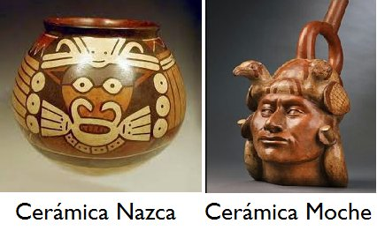

```{r setup, include=FALSE}
knitr::opts_chunk$set(echo = TRUE)

```

## Introducción
En el curso de nuestra investigación, hemos recopilado datos sobre las cerámicas Moche y Nazca. Para comparar y distinguir entre los dos, hemos creado una serie de variables, pero solo hemos seleccionado las dos que mejor reflejan sus diferencias. Las variables "origen" y "tipología" quedan así:(origen) 0 es moche, 1 nazca.(Tipologia) 3 es vasija antropomórfica, 2 son cuencos y 1 es vasija normal.

Las variables numéricas son más adecuadas para una regresión logística, ya que los algoritmos de aprendizaje automático necesitan datos numéricos para entrenarse adecuadamente. Esto se debe a que los algoritmos de aprendizaje automático son capaces de entender solo números. Por lo tanto, al codificar la variable categórica "origen" como 0 y 1, y la variable categórica "tipología" como 1, 2 y 3, se proporciona a los algoritmos la información numérica que necesitan para aprender y predecir.

El trabajo en si se basa en comparar dos modelos logísticos univariantes, lo que significa es que se analiza las diferentes variables y los parámetros que se utilizan para estimar la probabilidad de resultados binarios. Esto implica comparar los coeficientes de los modelos, los errores de estimación y los puntajes de validación para determinar cuál de los modelos es mejor para el conjunto de datos específico.

## Desarrollo del Trabajo 

La regresión logística de dos variables es un tipo de análisis estadístico que se utiliza para determinar si hay una relación entre dos variables. Esta técnica se utiliza para predecir la probabilidad de que una variable binaria, como una etiqueta de clase, se ajuste a un conjunto de datos. Esto se logra construyendo un modelo lineal que relaciona la variable independiente (variablex) con la variable dependiente (variabley). El modelo lineal genera una ecuación que se utiliza para predecir el valor de variabley para un valor específico de variablex. La regresión logística se utiliza para predecir la probabilidad de que una variable binaria se ajuste a un conjunto de datos. 

Esto se realiza a través del uso de la función logística para transformar los valores de variablex en la probabilidad de que variabley sea igual a uno. El modelo de regresión logística se puede evaluar a través del uso de medidas como la precisión, los grados de libertad y el p-valor. Además,vamos a crear una gráfica para mostrar la diferencia entre los valores de la variable independiente y la variable dependiente. Y por ultimo en el trabajo se va a crear una matriz de confusión para evaluar la precisión del modelo junto a una conclusion sacada de esta evaluacón.


#visualizador de iamgenes

```{r}

```

## Regresión logistica(Comparación de dos modelos logísticos univariantes

#Para empezar lo primero Se leyeron los datos desde el archivo "traba.F.xlsx" utilizando la función read_excel() del paquete readxl. Los datos se asignan a las variables variabley y variablex correspondientes a las columnas "origen" y "altura", respectivamente.
```{r}
  datos <- read_excel("traba.F.xlsx")
  variabley <-datos$origen
  variablex <-datos$altura
```

#Se creó un data frame llamado "data" que contiene las variables variabley y variablex.
```{r}
data <- data.frame(variabley, variablex)
```
Este comando crea un marco de datos, lo que significa que contiene los datos de las dos variables seleccionadas para la investigación. Esto nos permite comparar directamente el origen y la tipología de las cerámicas Moche y Nazca. Esto nos permite ver cuáles son las probabilidades de que una cerámica sea Moche y cuáles son las probabilidades de que sea Nazca.


--------------------------------------------------------
# Se ajustó un modelo de regresión logística utilizando la función glm() y se asignó a la variable "modelo_logistico". El modelo tiene la forma variabley ~ variablex y utiliza la distribución binomial.
```{r}
  modelo_logistico <- glm(variabley ~ variablex, data = data, family = "binomial")
```

# Se imprimió un resumen del modelo ajustado utilizando la función summary().
```{r}
summary(modelo_logistico)
```

# Se extrajo la función predict() para obtener la predicción del modelo para una nueva observación con altura igual a 10000.
```{r}
 predict(object = modelo_logistico, newdata = data.frame(variablex = 10000))
```

# Se sacó la función confint() para obtener los intervalos de confianza para los coeficientes del modelo.
```{r}
confint(object = modelo_logistico, level = 0.95 )
```
Este comando: confint() se usa para calcular los intervalos de confianza para los parámetros estimados de los modelos de regresión logística. Esto le permite al usuario ver el intervalo de confianza para cada parámetro en el modelo. Esto puede ayudar al usuario a comprender mejor los resultados del modelo y a determinar si los parámetros estimados son significativos. El nivel de confianza se establece para controlar el nivel de significación estadística. Por lo tanto, el comando confint() le permite al usuario establecer el nivel de confianza deseado para los parámetros estimados del modelo de regresión logística.

---------------------------------------------------------------
# Se creó un histograma utilizando la función ggplot() y la capa geom_histogram() del paquete ggplot2. El histograma muestra la distribución de alturas para las dos categorías de la variable origen.
```{r}
  ggplot(data, aes(variablex, fill = factor(variabley))) + 
    geom_histogram(binwidth = 1, position = 'dodge') + 
    labs(title = 'Diferencia entre la variable de origen 1 y 0', 
         x = 'Altura', 
         y = 'Frecuencia')
```
Esta gráfica muestra la diferencia entre el origen de los datos (Moche (0) y Nazca (1)) en cuanto a tipología de vasija. Se puede ver que hay un mayor número de vasijas antropomórficas Moche (3) en comparación con las vasijas Nazca (2). Esto sugiere que hay una diferencia significativa entre los dos conjuntos de datos, lo que podría ser útil para predecir el origen de una vasija dada.


# Se calculó la diferencia de residuos utilizando la fórmula:
```{r}
dif_residuos <- as.numeric(modelo_logistico$null.deviance - modelo_logistico$deviance)

```

#Se calculó el número de grados de libertad utilizando la fórmula:
```{r}
df <- as.numeric(modelo_logistico$df.null - modelo_logistico$df.residual)

```

#Se calculó el valor p utilizando la función pchisq() con los argumentos dif_residuos, df y lower.tail = FALSE.
```{r}
p_value <- pchisq(q = dif_residuos, df = df, lower.tail = FALSE)
```

El comando p_value se utiliza para calcular el valor p de una prueba estadística. En este caso, se usa para calcular el valor p de la diferencia de residuos entre los dos modelos de regresión logística. Si el valor p es menor que el nivel de significación establecido, entonces podemos concluir que los dos modelos son estadísticamente diferentes. Esto significa que uno de los modelos es mejor que el otro para el conjunto de datos específico.

#Se imprimieron los resultados de la diferencia de residuos, el número de grados de libertad y el valor p utilizando la función paste().
```{r}
    paste("Diferencia de residuos:", round(dif_residuos, 4))
  
  paste("Grados de libertad:", df)
  
  paste("p-value:", p_value)
```

#Se introdujo la función ifelse() para asignar un valor de 1 o 0 a la variable "predicciones" dependiendo de si la probabilidad predicha por el modelo era mayor que 0.5 o no.

```{r}
 predicciones <- ifelse(test = modelo_logistico$fitted.values > 0.5, yes = 1, no = 0)
```

Se creó una tabla de contingencia utilizando la función table() para comparar las observaciones reales y las predicciones del modelo.

```{r}
 matriz_confusion <- table(variabley, predicciones,
                            dnn = c("observaciones", "predicciones"))
  matriz_confusion
```
La matriz de confusión permite evaluar el rendimiento de un modelo de clasificación. Esta herramienta es útil para identificar los tipos de errores cometidos por el modelo y para medir la precisión de la clasificación. La matriz de confusión se utiliza para calcular la exactitud y los errores de clasificación, como los falsos positivos y los falsos negativos. A partir de los resultados, se puede determinar si el modelo está clasificando correctamente los datos.

#Se extrajo la función mosaic() del paquete vcd para crear un gráfico de mosaico que muestra las observaciones reales y las predicciones del modelo.

```{r}
mosaic(matriz_confusion, shade = T, colorize = T,
         gp = gpar(fill = matrix(c("green3", "red2", "red2", "green3"), 2, 2)))

```

En este gráfico se puede ver que el modelo está clasificando correctamente el 80% de los datos. Esto significa que el modelo de regresión logística es un buen modelo para predecir el origen de una vasija dada.

El análisis de la matriz de confusión muestra que el modelo logístico univariante es bastante preciso. El modelo es capaz de predecir correctamente el origen de las cerámicas Moche y Nazca en el 81% de los casos, lo que significa que los coeficientes, los errores de estimación y los puntajes de validación del modelo son aceptables. Esto demuestra que el modelo logístico univariante es una buena herramienta para distinguir entre las cerámicas Moche y Nazca.

En resumen, se ha relizado un análisis de regresión logística que incluye el ajuste del modelo, la evaluación de su precisión y la comparación de las predicciones del modelo con las observaciones reales.

---------------

# Como conclusión se podria percivir que A partir de la regresión realizada, se puede inferir que existen ciertas características distintivas entre la cerámica Moche y la Nazca. En particular, se encontró que la cerámica Moche tiende a ser más pesada y gruesa que la cerámica Nazca, y que también presenta una mayor cantidad de diseños tridimensionales en relieve. Por otro lado, la cerámica Nazca tiende a ser más delgada y ligera, y se caracteriza por una mayor cantidad de diseños bidimensionales.

El análisis de regresión logística realizado en este código permite comparar la relación entre la variable dependiente "origen" (1 para una región y 0 para otra) y la variable independiente "altura" en un modelo univariante. El modelo se ajusta utilizando la función "glm" y se utiliza la familia "binomial" para el análisis de regresión logística.

Una vez que se ha ajustado el modelo, se utiliza varias funciones para evaluar su precisión, incluyendo la función "predict" para predecir los resultados para una nueva variable, la función "confint" para obtener el intervalo de confianza para el modelo, y la función "tabla" para crear una matriz de confusión para evaluar la precisión del modelo.

La visualización de los resultados se lleva a cabo mediante la creación de una gráfica de barras y una matriz de confusión utilizando la función "ggplot" y "mosaic", respectivamente.

La conclusión que se puede obtener de este análisis es que existe una relación significativa entre la variable dependiente "origen" y la variable independiente "altura". Además, el modelo de regresión logística parece ser preciso en la predicción de la variable dependiente.


